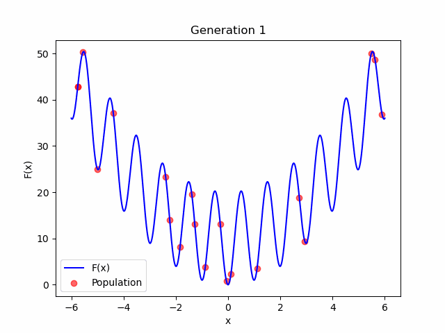
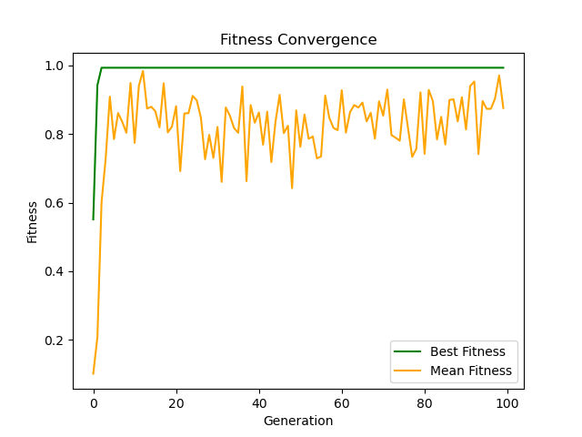
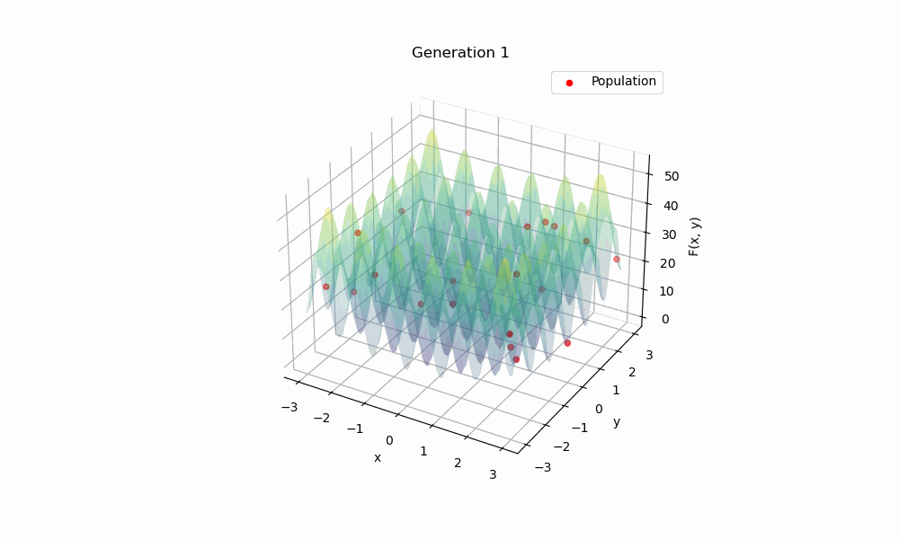
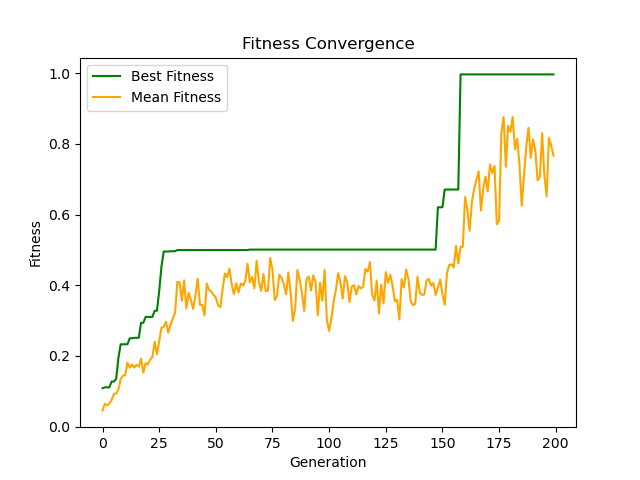

# GeneticAlgorithm

This project implements a Genetic Algorithm (GA) framework in Python. The algorithm simulates the process of natural selection to solve optimization problems, aiming to find the minimum or maximum value of a target function (In this demonstration, we aim to find the minimum value). The implementation includes core GA operations like selection, crossover, and mutation, with support for binary-encoded solutions.

---

## Overview of Genetic Algorithms

Genetic Algorithms are inspired by [Darwin's theory](https://en.wikipedia.org/wiki/Darwinism) of evolution. They use techniques such as selection, crossover, and mutation to evolve a population of candidate solutions toward an optimal solution.

### Key Concepts

1. **Population**: The **Population** is a group of individuals, each representing a potential solution to the optimization problem. There are several key considerations when defining a population:

    1. **Population Size**
       - **Definition**: The total number of individuals in the population.
       - **Typical Range**: 100 ~ 200 individuals.
       - **Trade-offs**:
         - A larger population size generally improves the diversity and quality of solutions.
         - However, larger populations increase the computational time required for each iteration.

    2. **Number of DNAs**
       - **Definition**: The number of variables (or parameters) that define each individual.
       - **Typical Range**: There is no typical range for the number of DNAs, since it depends on the dimension of the problem that we are going to solve.
       - **Trade-offs**: A larger number of DNAs may require more iterations to complete.

    3. **Length of Each DNA**
       - **Definition**: It is optional, since this is based on the method of encoding and decoding the gene. In our case, the number of bits used to represent each variable in binary encoding.
       - **Typical Range**: There is no typical range for the number of DNAs, since it depends on how precise the solution is desired.
       - **Trade-offs**:
         - Longer DNAs provide finer granularity for the solution space, allowing for more precise solutions.
         - However, longer DNAs also increase the computational cost.

2. **Fitness Function**: Measures the quality of a solution. Higher (or lower, depending on your selection method) fitness indicates a better solution. Below are some common fitness functions:

   1. **Linear Function** **$f(x) = x$**:
      - **Description**: This is the simplest way to decide fitness.
      - **Code Example**:

        ```python
        fitness = x  # To find the maximum value
        fitness = -x  # To find the minimum value
        ```

   2. **Inverse Function** **$f(x) = \frac{1}{x}$**: This is what we used in the demonstration.
      - **Code Example**:

        ```python
        fitness = 1 / (1 + x)
        ```

   3. **Quadratic Function** **$f(x) = x^2$**
      - **Code Example**:

        ```python
        fitness = 1 / (1 + x**2)
        ```

3. **Selection**: Chooses individuals based on their fitness to create the next generation. There are several ways to achieve it:

   1. **Roulette Wheel Selection**:
      - **Definition**: The probability of selecting an individual is proportional to its fitness value.
      - **Explanation**: Each individual is assigned a portion of the "wheel" based on its fitness. The wheel is spun randomly to select an individual. Higher fitness individuals have a larger portion of the wheel, meaning they have a higher chance of being selected.
      - **Pros**: Simple and effective.
      - **Cons**: It can lead to a loss of diversity, especially when there are individuals with very high or very low fitness.

   2. **Rank Selection**:
      - **Definition**: The probability of selecting an individual is based on its rank in the population after sorting by fitness.
      - **Explanation**: Individuals are ranked based on their fitness, and then selection is made based on their rank. This reduces the risk of selecting only the fittest individuals, preserving diversity.
      - **Pros**: Ensures selection pressure is distributed across the population.
      - **Cons**: May still result in premature convergence if not balanced properly.

   3. **Tournament Selection**:
      - **Definition**: A set of individuals are randomly chosen, and the individual with the best fitness in the group is selected.
      - **Explanation**: A subset of the population is randomly selected, and the individual with the highest fitness in that subset is chosen as the winner. This process is repeated until the desired number of individuals is selected.
      - **Pros**: Can maintain diversity and is relatively easy to implement.
      - **Cons**: The selection process can become biased if the tournament size is not chosen carefully.
   4. **Improvement Suggestion**:
      - We could preserve elites (top individuals) forcefully to preserve excellent genes. This ensures that the best solutions are not lost in the evolutionary process.

4. **Crossover**: Combines two parent solutions to create offspring, introducing variation. There are a few methods.

   1. **Single-Point Crossover**:
      - **Description**: In Single-Point Crossover, a single crossover point is randomly chosen. The genes from both parents are exchanged at this point to create two offspring. This is the method used in the demonstration.
      - **Process**:
        1. Randomly select a point along the chromosome (a specific gene position).
        2. Swap the segments after this point between the two parents.
        3. The resulting two offspring inherit part of the genes from each parent.
      - **Example**: If the parents are:
        - Parent 1: `101010`
        - Parent 2: `110011`
        After a crossover point (e.g., after the 3rd bit):
        - Offspring 1: `101011` (`101` from Parent1, `011` from Parent2)
        - Offspring 2: `110010` (`110` from Parent2, `010` from Parent1)

   2. **Two-Point Crossover**:
      - **Description**: In Two-Point Crossover, two points are selected on the chromosome, and the segments between those two points are swapped between the parents.
      - **Process**:
        1. Randomly select two points along the chromosome.
        2. Exchange the genes between these two points from each parent.
        3. The offspring are created with part of the genes from both parents.
      - **Example**: If the parents are:
        - Parent 1: `101010`
        - Parent 2: `110011`
        After two crossover points (e.g., after the 2nd and 5th bit):
        - Offspring 1: `111011)` (`11` from Parent2, `10` from Parent1, `10` from Parent2)
        - Offspring 2: `100010)` (`10` from Parent1, `00` from Parent2, `10` from Parent1)

5. **Mutation**: Randomly alters parts of a solution to maintain genetic diversity. There are several ways:

   1. **Bit-flip Mutation**:
      - **Description**: Randomly flips one bit of the DNA sequence. This is the most common mutation method, especially in binary encoding. This is the method used in the demonstration.
      - **Example**: For a binary sequence `101010`, if the third bit is chosen, the mutated sequence will become `100010`.

   2. **Swap Mutation**:
      - **Description**: Randomly selects two positions in the DNA sequence and swaps their values. This is commonly used in permutation-based problems like the Traveling Salesman Problem (TSP).
      - **Example**: For a sequence `[1, 2, 3, 4, 5]`, swapping the second and fourth positions results in `[1, 4, 3, 2, 5]`.

   3. **Insertion Mutation**:
      - **Description**: Randomly selects one gene in the sequence and moves it to a different position. This is also used in permutation problems.
      - **Example**: For a sequence `[1, 2, 3, 4, 5]`, if the second element (`2`) is moved to the fourth position, the new sequence becomes `[1, 3, 4, 2, 5]`.

---

## Features of This Implementation

- **Binary Encoding**: Solutions are represented in binary form.
- **Flexible Fitness Scaling**: The framework supports any fitness function.
- **Elitism**: Top-performing solutions are preserved for the next generation.
- **Configurable Parameters**:
  - Population size
  - DNA length (resolution of solutions)
  - Mutation rate
  - Crossover rate
  - Elitism rate
  - Search bounds

---

## Demonstration and Results

In this demonstration, we apply the **Rastrigin Function** as an optimization problem for the Genetic Algorithm, visualizing its performance in both 2D and 3D spaces.

### 2D Problem

In the 2D case, the algorithm quickly converged to the optimal solution within 10 iterations. Below are the results:

- **Evolution of Population (2D)**: 
  The GIF below shows how the population evolves towards the optimal solution over time.
  
  
- **Fitness Convergence (2D)**:
  The graph below illustrates the change in the best and mean fitness values throughout the iterations.
  

### 3D Problem

The 3D problem is more complex, and the algorithm found a local optimum in the 26th iteration. It reached the best solution after 150 iterations. Below are the results:

- **Evolution of Population (3D)**: 
  The GIF below shows the progression of the population in the 3D space as it converges to the optimal solution.
  

- **Fitness Convergence (3D)**:
  The graph below demonstrates how the best and mean fitness values evolve over time.
  
